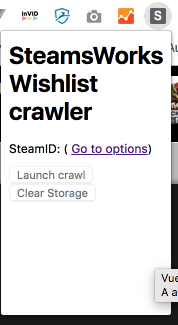

# Steam Wishlist stats extension
Chrome extensions to get quick Steam Wishlist stats concatened for all games/DLC of an owner

## Download
the chrome extension is downloadable [here](build/swlext.crx)

## Install
After have downloaded the CRX file, open [chrome://extensions/](chrome://extensions/) in your browser, and drag the crx file on this page. This will start the installation of the extension in chrome.

## Usage & configration
After You install the extension, go to [https://partner.steamgames.com](https://partner.steamgames.com) and connect you with you buisness account. You should see in the toolbar of chrome a new icon (a 'S' in a gray/black box, like this: ), if you are connected and on a tab on [https://partner.steamgames.com](https://partner.steamgames.com), it should be enabled, disabled in other case.

Click on the tool button, and you get a popup (cf. image 1) with many things disabled the first time and an active link to "options".

Click on it and you see the options dialog box (cf. image 2) where you should write the steam id of the steam partner. Click save. Now, close options page.

If you reopen the extensions popup (close it if it's open yet) (cf. image 3), you see information of the configured SteamID and button to launch crawl operation. You can click on it. And the magic occurs!

When the operation is finished, the animate loader on the popup disappear and you will se information of last crawl (date, finish time, and link to get the result csv file).

